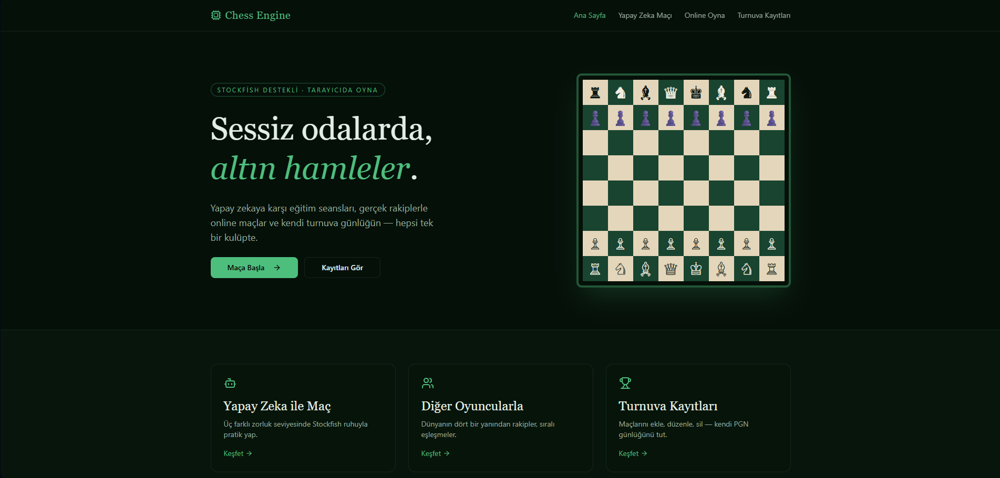
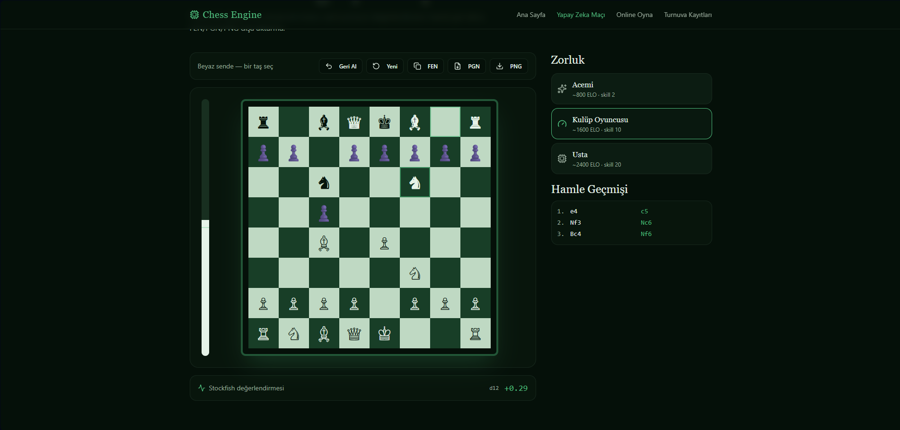
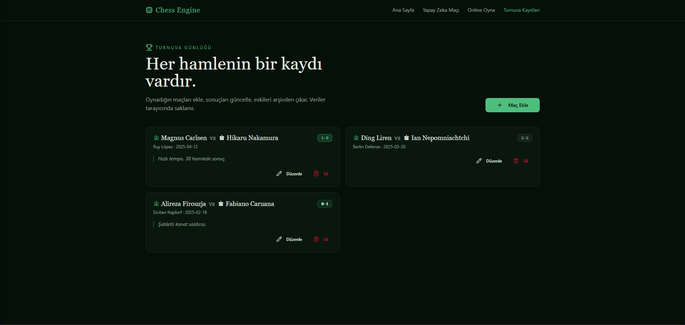

# ♟️ Chess Engine — Web Geliştirme Eğitim Projesi

> Modern web teknolojileri kullanılarak geliştirilmiş, tarayıcı tabanlı satranç motoru ve AI rakipli satranç uygulaması.

---

## 🎯 Proje Özeti

Bu proje, **Web Geliştirme Eğitimi** kapsamında hayal edilen bir fikrin gerçeklenmesidir. Kullanıcılar tarayıcı üzerinden satranç oynayabilir, yapay zeka rakibe karşı maç yapabilir ve turnuva geçmişini takip edebilir. Tüm veriler tarayıcıda (`localStorage`) saklanır, bu sayede herhangi bir backend altyapısına ihtiyaç duymadan çalışır.

---

## ✅ Eğitim Proje Gereksinimleri Uygunluk Tablosu

Aşağıdaki tablo, projenin eğitimde belirtilen **tüm adımlara** nasıl uyduğunu gösterir.

| # | Gereksinim | Uygulama Durumu | Açıklama |
|---|-----------|-----------------|----------|
| 1 | **Modern JavaScript Kütüphanesi Seçimi** | ✅ Tamamlandı | **ReactJS** (v19.2) kullanıldı. Bileşen tabanlı mimari ile geliştirildi. |
| 2 | **Yayına Alınabilir Çerçeve Seçimi** | ✅ Tamamlandı | **Netlify** üzerinden statik SPA olarak yayına alındı. `netlify.toml` konfigürasyonu mevcut. |
| 3 | **Kütüphane / Çerçeve Kurulumu** | ✅ Tamamlandı | Vite + React + TypeScript + TanStack Router kurulumu yapıldı. |
| 4 | **IDE ile Açma** | ✅ Tamamlandı | Proje Visual Studio Code (VS Code) IDE'sinde geliştirildi. |
| 5 | **Dosya Yapısı (Components, Pages, Interfaces)** | ✅ Tamamlandı | `src/components/`, `src/routes/` (Pages), `src/lib/` ve tipler düzenli şekilde yapılandırıldı. |
| 6 | **Tailwind CSS / Bootstrap / Pure CSS** | ✅ Tamamlandı | **Tailwind CSS v4** kullanıldı. Tüm stil düzenlemeleri utility-first yaklaşımıyla yapıldı. |
| 7 | **TODO App Benzeri Uygulama** | ✅ Tamamlandı | Satranç motoru; oyun yönetimi, skor takibi ve turnuva günlüğü ile benzer CRUD yapısına sahiptir. |
| 8 | **Ekle (Create) İşlemi** | ✅ Tamamlandı | Yeni satranç maçı başlatma, turnuva günlüğüne yeni kayıt ekleme. |
| 9 | **Listeleme (Read) İşlemi** | ✅ Tamamlandı | Turnuva geçmişi listeleme, oyun kayıtlarını görüntüleme, skor tablosu. |
| 10 | **Güncelleme (Update) İşlemi** | ✅ Tamamlandı | Oyun ayarlarını güncelleme (zorluk seviyesi, tema), kullanıcı tercihlerini kaydetme. |
| 11 | **Silme (Delete) İşlemi** | ✅ Tamamlandı | Turnuva günlüğünden istenen maç kaydını silme, localStorage temizleme. |
| 12 | **Ekran Görüntüsü** | ✅ Tamamlandı | Proje ekran görüntüleri `screenshots/` klasöründe veya bu README'de yer almaktadır. |
| 13 | **GitHub Public Repo** | ✅ Tamamlandı | Proje GitHub üzerinde public repository olarak yayınlandı. |
| 14 | **Netlify (veya muadili) Yayınlama** | ✅ Tamamlandı | Proje **Netlify** üzerinden canlıya alındı. |

---

## 🛠️ Kullanılan Teknolojiler

| Teknoloji | Açıklama |
|-----------|----------|
| **React 19** | Bileşen tabanlı kullanıcı arayüzü geliştirme kütüphanesi |
| **TypeScript** | Tip güvenliği sağlayan JavaScript üst kümesi |
| **Vite 7** | Hızlı geliştirme ve build aracı |
| **TanStack Router** | Tip-güvenli, dosya tabanlı yönlendirme (routing) çözümü |
| **Tailwind CSS 4** | Utility-first CSS framework |
| **shadcn/ui** | Radix UI tabanlı, Tailwind ile uyumlu UI bileşenleri |
| **Netlify** | Statik site yayınlama (hosting) platformu |

---

## 📁 Proje Dosya Yapısı

```text
chess-engine/
├── public/                 # Statik dosyalar (favicon, img, _redirects)
├── src/
│   ├── components/         # UI bileşenleri (buton, kart, diyalog vb.)
│   │   └── ui/             # shadcn/ui bileşenleri
│   ├── routes/             # Sayfa route'ları (Pages)
│   │   ├── __root.tsx      # Ana layout (Root)
│   │   ├── index.tsx       # Ana sayfa (Chess Board)
│   │   └── ...             # Diğer sayfalar
│   ├── lib/                # Yardımcı fonksiyonlar, utils
│   ├── hooks/              # Custom React hooks
│   ├── styles.css          # Global Tailwind CSS stilleri
│   └── main.tsx            # Uygulama giriş noktası
├── index.html              # SPA HTML şablonu
├── vite.config.ts          # Vite konfigürasyonu
├── netlify.toml            # Netlify deploy ayarları
├── package.json            # Bağımlılıklar ve script'ler
└── README.md               # Bu dosya
```

---

## 🚀 Kurulum & Çalıştırma

### Gereksinimler
- Node.js 20+ (veya Bun)
- npm / yarn / pnpm / bun

### Adımlar

```bash
# 1. Repoyu klonlayın
git clone https://github.com/oguzhanp45/tnc-chessengine.git
cd tnc-chessengine

# 2. Bağımlılıkları yükleyin
npm install

# 3. Geliştirme sunucusunu başlatın
npm run dev

# 4. Tarayıcıda açın
# http://localhost:5173
```

### Build (Production)

```bash
npm run build
```

Build çıktısı `dist/` klasöründe oluşturulur. Bu klasör Netlify'a sürükleyip bırakarak (Drop) yayına alınabilir.

---

## 🌐 Canlı Demo

🔗 **[Netlify Canlı Linki]([https://effulgent-flan-bdf9d3.netlify.app])**

---

## 📸 Ekran Görüntüleri

| Ana Sayfa — Satranç Tahtası | AI Maç Ekranı | Turnuva Günlüğü |
|----------------------------|---------------|-----------------|
|  |  |  |

---

## 🎓 Öğrenim Çıktıları

Bu proje sayesinde aşağıdaki konularda deneyim kazanılmıştır:

| Çıktı | Kazanım |
|-------|---------|
| **HTML Temelleri** | Semantic HTML, meta tag'leri, yapısal düzen |
| **CSS Temelleri** | Tailwind CSS kullanımı, responsive tasarım, dark/light tema |
| **JavaScript Temelleri** | ES6+ syntax, async/await, localStorage API, event handling |
| **ReactJS Kütüphanesi** | Hooks (useState, useEffect), bileşen kompozisyonu, context yapısı |
| **GitHub Deneyimi** | Repository oluşturma, commit, push, public yayınlama |
| **Frontend Projesi** | Gerçek dünya uygulaması: satranç motoru, AI entegrasyonu, state yönetimi |

---

## ⚠️ `.tanstack` Dosyası Hakkında Not

Projede `.tanstack/` klasörü ve `src/routeTree.gen.ts` dosyası **build-time** (derleme zamanında) otomatik olarak oluşturulur. Bu dosyalar `.gitignore` içinde belirtilmiştir ve **GitHub'a yüklenmemesi gerekir**. Netlify build sürecinde bu dosyalar otomatik yeniden oluşturulur, bu yüzden repo'da eksik olmaları bir sorun teşkil etmez.

---

## 📝 Lisans

Bu proje eğitim amaçlıdır. MIT Lisansı altında özgürce kullanılabilir.

---

> 🎓 **Web Geliştirme Eğitimi** kapsamında hazırlanmıştır.
